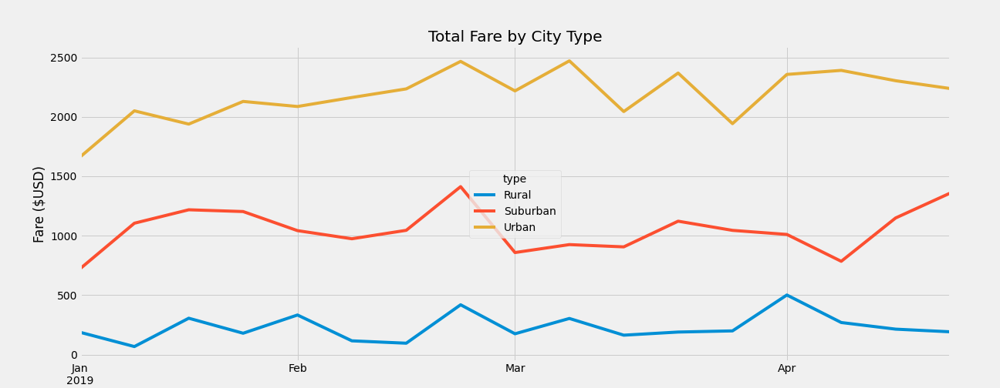

# PyBer Analysis Challenge

## Project Overview

The aim of the project is to carry out a summary analysis of ride-sharing data by the city type.

The city type are as follows:
* Rural
* Suburban
* Urban

#### Metrics

The ride-sharing metrics we will be lookin at per city type will be:

* Total Number of Rides 
* Total Drivers
* Total Fares 
* Average Fare per Ride and
* Average Fare per Driver

## Results

Below is a table showing the results of the metrics.

|              | Total Rides | Total Drivers | **Total Fares** | **Average Fare per Ride** | **Average Fare per Drive**r |
| ------------ | ----------- | ------------- | --------------- | ------------------------- | --------------------------- |
| **Rural**    | 125         | 78            | $4,327.93       | $34.62                    | $55.49                      |
| **Suburban** | 625         | 490           | $19,356.33      | $30.97                    | $39.50                      |
| **Urban**    | 1,625       | 2,405         | $39,854.38      | $24.53                    | $16.57                      |

​																			Table 1: Pyber Summary 

From the table above it can be seen that Urban cities have a lot more rides, drivers and generated more revenue than Rural and Suburban cities. But the average fare per ride and the average fare per driver were higher in rural cities compared with suburban and urban cities. 

The Total Drivers in the Rural city types were significantly lower than the Suburban and Urban city types.

A study was carried out to see the total fare by city type form January to April 2019 which was a 4-month period. The results of the analysis are listed in the table below and can also be seen in the image 1.

| Date       | Total Rural Fares | Total Suburban Fares | Total Urban Fares |
| ---------- | ----------------- | -------------------- | ----------------- |
| 2019-01-06 | $187.92           | $721.60              | $1,661.68         |
| 2019-01-13 | $67.65            | $1,105.13            | $2,050.43         |
| 2019-01-20 | $306.00           | $1218.20             | $1939.02          |
| 2019-01-27 | $179.69           | $1203.28             | $2129.5           |
| 2019-02-03 | $333.08           | $1042.79             | $2086.94          |
| 2019-02-10 | $115.80           | $974.34              | $2162.64          |
| 2019-02-17 | $95.82            | $1045.50             | $2235.07          |
| 2019-02-24 | $419.06           | $1412.74             | $2466.29          |
| 2019-03-03 | $175.14           | $858.46              | $2218.20          |
| 2019-03-10 | $303.94           | $925.27              | $2470.93          |
| 2019-03-17 | $163.39           | $906.20              | $2044.42          |
| 2019-03-24 | $189.76           | $1122.20             | $2368.37          |
| 2019-03-31 | $199.42           | $1045.06             | $1942.77          |
| 2019-04-07 | $501.24           | $1010.73             | $2356.70          |
| 2019-04-14 | $269.79           | $784.82              | $2390.72          |
| 2019-04-21 | $214.14           | $1149.27             | $2303.80          |
| 2019-04-28 | $191.85           | $1357.75             | $2238.29          |

​														Table 2: Total Fare per City Type

​														Image 1: PyBer Fare Summary

From the image, the urban cities had the highest total amount of fares in comparison with the suburban and rural cities within a 4-month span. Table 1 shows why there is a huge disparity in total fares

## Summary

From the Tables and chart, it can be seen that the Urban cities generate a lot more revenue than the Suburban and rural cities.

The following can be deducted:

* There were a total of 125 rides and 78 total drivers in the rural cities which paled in comparison to the Suburban and Urban cities.
* The Average Fare per ride was also higher in the rural areas at $34.62 when compared with the Suburban ($30.97) and the Urban ($24.53)
*  The drivers made an average of $55.49 in Rural Areas which is significantly higher than the Suburban ($39.50) and the Urban ($16.57) despite have the Rural cities having significantly less drivers.

### Recommendations

* Increase the number of drivers in the Rural cities by offering incentives to the driver. The increase in drivers will reduce the cost for riders
* Offer promos to the riders in the Rural areas to increase the total number of riders which will drive the revenue generation up.
* Find out why there are less riders and drivers in the rural areas. Could it be distance, or less drivers stay in those areas, etc?

